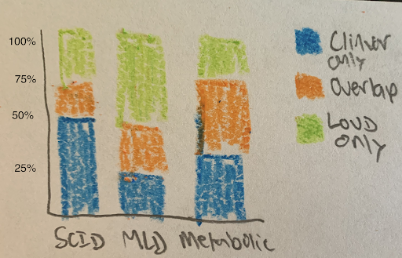
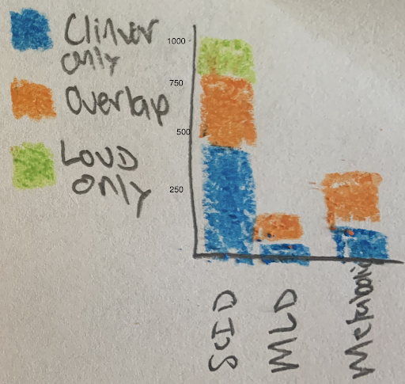
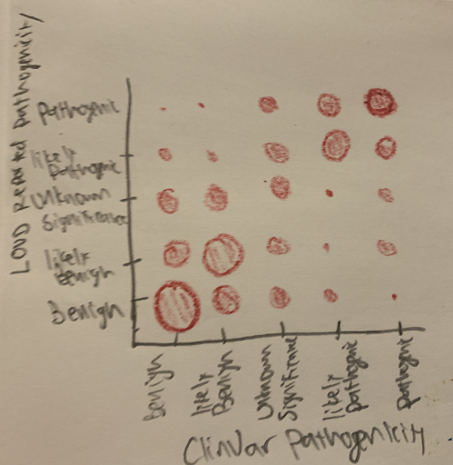
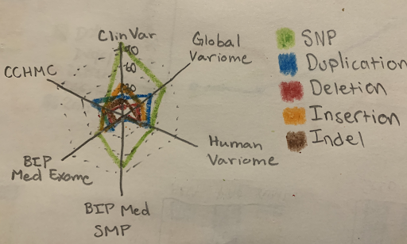
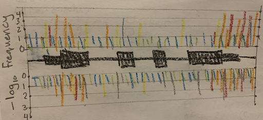

# Project Updates

As things have progressed throughout the semester, we have made a number of changes
to what we plan to do for our final project. Here we will discuss the larger changes
to our plans.

### Limiting the Dataset
We originally proposed to use 3 different diseases with 55 genes combined. We
obtained data for all 55 genes and prepared everything as if to use all 3 diseases.
However, we realized that this was simply too much for us to work with. We have
removed two figures that show the overlap between LOVD and ClinVar, and limited
the dataset to only Metachromatic Leukodystrophy (MLD). This means that we will
be working with only three genes. This will still allow us to make the majority
of the figures, but will be much simpler for us to sort and work with.

### No Longer Using SQLite
We originally planned to read everything into a SQLite3 database, then host a flask
server that would allow us to use SQL commands to obtain information for building the
figures. Using SQL was really the only way to make the queries fast enough to
reasonably update the figures. The SQLite database is actually built and present in
the [SQL](../SQL) folder. However, setting up a flask server to be able to return the
queries turned out to be too difficult. The decision to limit the dataset to a single
disease means that JavaScript will be fast enough to perform all of the calculations
without sending queries to a SQL server. Therefore we abandoned the idea of using
SQLite and are now simply using JavaScript.

### Removing Certain Figures
We originally had two figures showing the overlap between ClinVar and the LOVD
databases per each disease. We now have only one disease (MLD), so these figures
would not really be relevant. All of the information from these bar charts could
also be found in other figures, so we have chosen to remove these two figures.

We also had planned to include a figure showing a comparison of the pathogenicity
reported for variants present in both LOVD and ClinVar. Unfortunately, LOVD contains
reported pathogenicity information only for some genes. As it turns out, all three
of the MLD genes have no reported pathogenicity, so this figure no longer makes any
sense.

Devin also suggested that we remove the radar chart as the information can be found
in other figures and the chart itself is rather noisy and difficult to interpret.

One more figure was still relevant, but it was by far the most complicated figure
proposed. This was the graph with lines representing individual variants, with the
height representing the frequency (-log10 of the overall minor allele frequency),
and rectangles representing the exons of the gene. Most of this information is present
in the scatter plot with location (from transcription start site) along the X-axis
and frequency (-log10) on the Y-axis, but this figure would have shown differences
in reported pathogenicity between LOVD and ClinVar. As it turns out, all of the LOVD
variants would have been gray so this would be far less interesting. Considering that
this graph would have take so much effort to make and that the important information
can also be seen in the scatter plot, we chose to remove this figure.

### Removing date from the filter criteria

In addition to these figures being removed, there was one filter that was removed:
the submission date. Originally we were going to have the option to filter based on
the year that the variant was submitted to the website. Unfortunately, almost all
of the LOVD variants and a significant proportion of the ClinVar variants were found
to have no reported date. As a result, we chose to remove the option to filter by
year of submission.

### Adding StoryTelling

We added a storytelling function. When you click the button labeled 'Show an
example of how this information is helpful', the scatter plot is generated with
variants from ARSA. The 'pathogenic' and 'likely pathogenic' variants are made
larger (radius of 7 instead of 4) and darker (opacity 1 while other variants have
opacity of 0.4). Additionally, there are three SVGs that appear. All three contain
white rectangles with black borders and text. The first one instructs the user to
scroll down. The second one says 'Keep scrolling!' The final one is next to the
scatterplot and points out that variants appear across the entire gene, but
all 'pathogenic' and 'likely pathogenic' variants are only in the coding regions
of the gene, indicating that new variants that are found in the untranslated
regions are very unlikely to be pathogenic.

### Hosting and Video

We were able to host the website on [GitPages](https://davidwsant.github.io/dataviscourse-clinvar_lovd_overlap/).
We obtained permission from Alex Lex to make our video over 2 minutes as long as
it was shorter than 2:30. Our video is now posted on [YouTube](https://www.youtube.com/watch?v=ChWy0Gjzrso&feature=youtu.be) and is 2 minutes and 26 seconds long.
